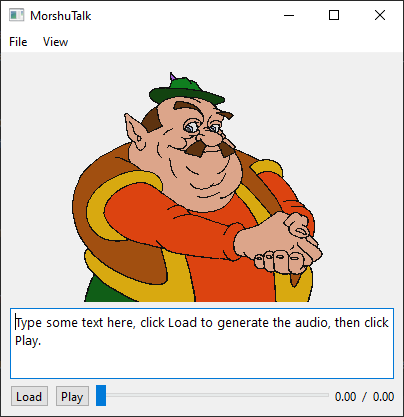

# MorshuTalk

A [Morshu](https://knowyourmeme.com/memes/morshu) text-to-speech program.

This program works by converting the given text into phonemes with [g2p_en](https://pypi.org/project/g2p-en/), then
concatenates the segments of Morshu's audio where he speaks those phonemes.

I'll improve this readme later when the project becomes more stable.

## Running
Install the packages in `requirements.txt`, then run `py gui` to load the GUI.

Right now, this repo's root directory must be in PYTHONPATH for it to work. (PyCharm does this automatically.)
In Windows, you can do this with `set PYTHONPATH=%PATH%;%PYTHONPATH%;`.

## License
[MIT License](LICENSE.txt)

This uses the following libraries:
* [g2p_en](https://pypi.org/project/g2p-en/)
* [Pydub](http://pydub.com/)
* [sounddevice](https://pypi.org/project/sounddevice/)
* [Qt for Python](https://wiki.qt.io/Qt_for_Python)
